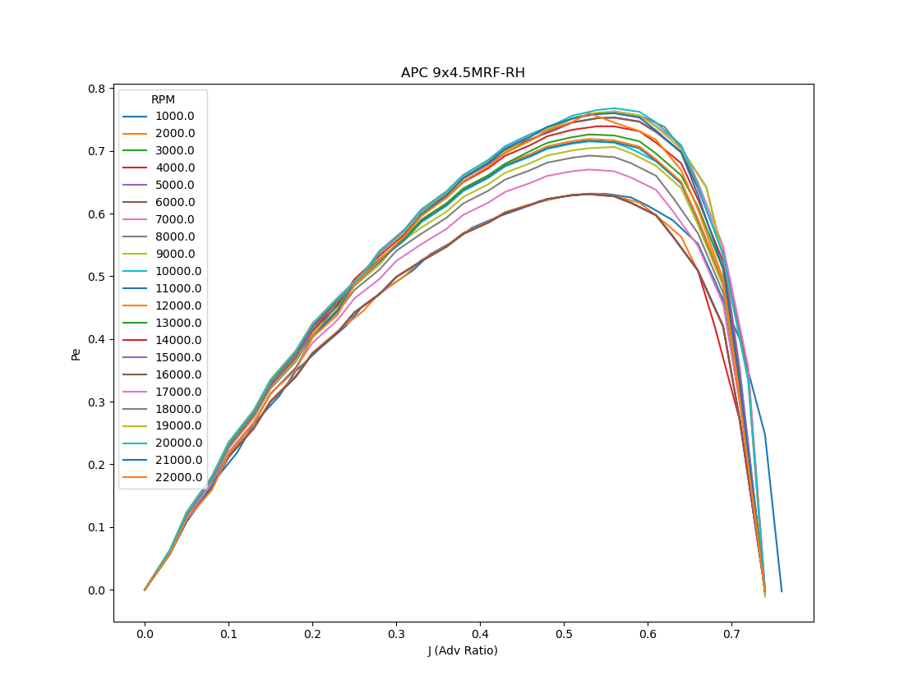

# UAS Prop Plot
Simple parsing, manipulation, and plotting tool for publicly available small UAS propeller data. 

Diameter | Pitch  | Descriptor | RPM | V | J | Pe | Ct | Cp | PWR | Torque | Thrust
--- | --- | --- | --- | --- | --- | --- | --- | --- | --- | --- | --- 
9|4.5|MRF-RH|1000|0|0|0|0.122|0.0522|0|0.016|0.026

## Install
Recommend setting up a [Python virtual environment](https://docs.python.org/3/tutorial/venv.html), dependencies include:
* [Pandas](https://pypi.org/project/pandas/)
* [matplotlib](https://pypi.org/project/matplotlib/)

`git clone https://github.com/mvacanti/uas_prop_plot.git`

## Using

Download propeller data from APC [here](https://49u9ei2todm6vjegs45ceqp1-wpengine.netdna-ssl.com/wp-content/uploads/2020/09/PERFILES_WEB-202009.zipx).

Extract data to desired location.

`python process_apc.py --dir=location/of/apc/files.dat --specs=location/of/apc/TITLE.DAT`

Additional prop data [here](https://www.apcprop.com/technical-information/file-downloads/).